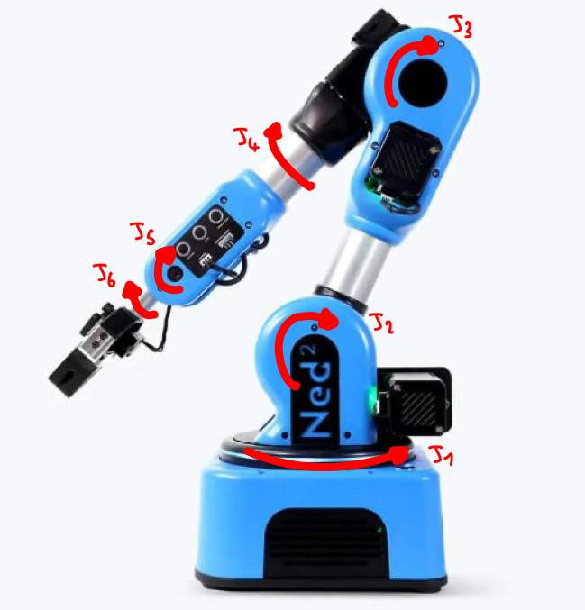
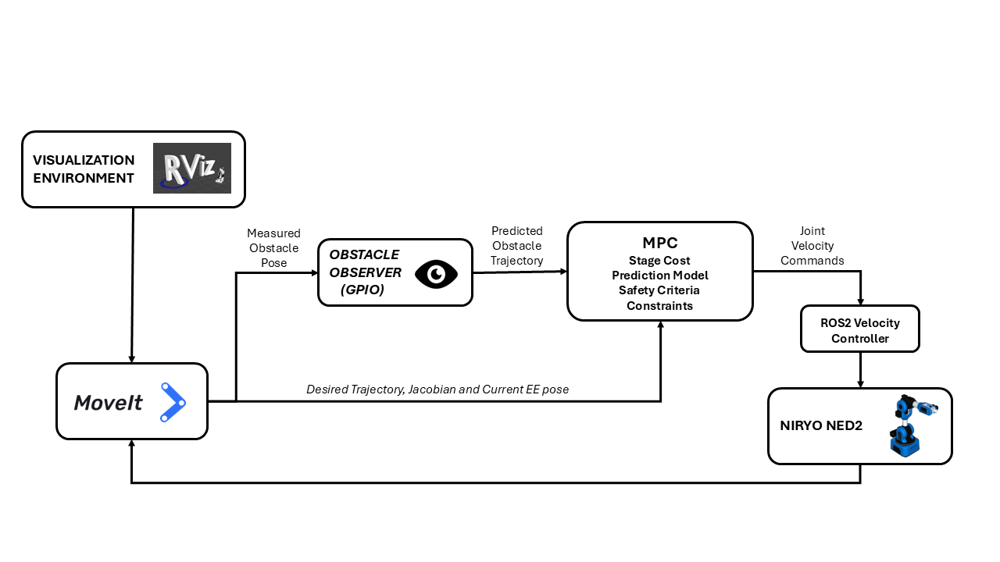
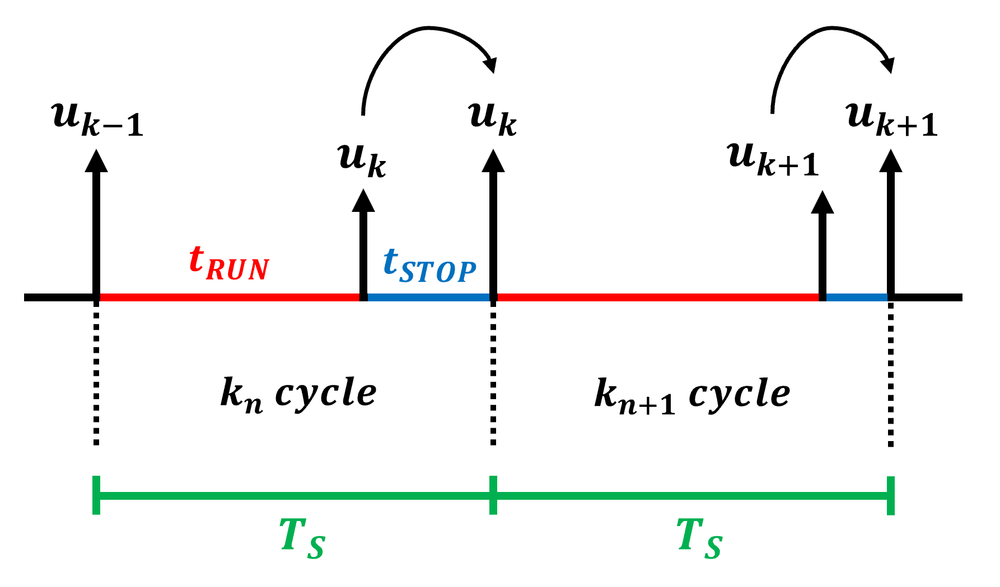
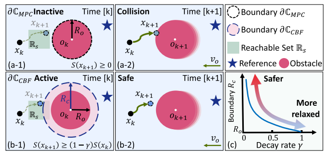
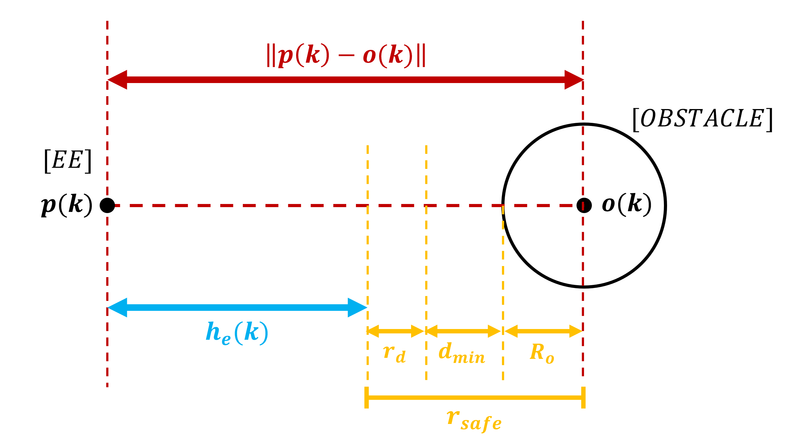
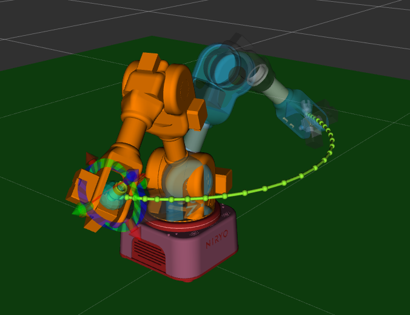
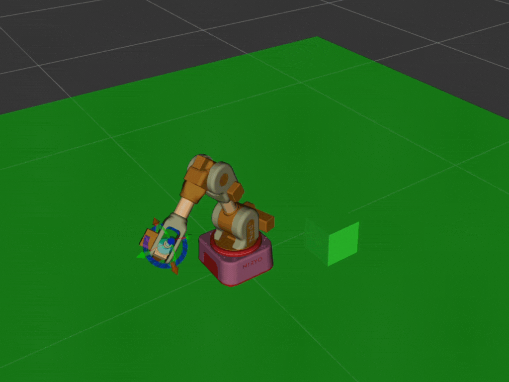

# 🤖 Predictive Control of a Robotic Manipulator (Dynamic Obstacles)

Implemented a predictive control framework for a robotic arm capable of safe trajectory tracking in dynamic environments. Developed as **Master’s thesis** in Automation Engineering at Politecnico di Bari.

---

## 🚀 Overview

This project addresses the challenge of controlling an advanced robotic manipulator (Niryo Ned2) in environments where **dynamic obstacles** may interfere with task execution. 

<p align="center">
  
</p>

The controller computes **optimal joint velocities** in real-time, integrating:

- **Kinematic prediction models** of the robot  
- A **Generalized Proportional Integral Observer (GPIO)** for estimating obstacle motion  
- **Safety constraints** based on Control Barrier Functions (CBFs) with **dynamically optimized decay rates**  

This approach ensures a **balance between efficiency and robustness**, adapting the safety margins in real-time while maintaining accurate trajectory tracking.

Simulation and testing are performed in **RViz** within the **ROS2 and MoveIt2** frameworks.

<p align="center">
  
</p>

---

## 🧰 Technologies

- 
- 
- 
- 
- 
- 
- 

---

## ⚙️ System Description

The **closed-loop MPC controller** performs the following at each cycle:

1. Updates the robot's **current state**  
2. Computes the **Jacobian** once per cycle  
3. Builds and solves the **optimization problem** using **CasADi/IPOPT**  
4. Applies **warm-starting** with the previous solution  
5. Publishes the **optimal joint velocities** for execution

<p align="center">
  
</p>

### Safety via CBF

- Ensures a **minimum safe distance** from obstacles  
- Safety constraints included as **decision variables** within the MPC problem  
- Dynamically optimized decay rates allow **real-time adaptation of safety margins**

<p align="center">
  
</p>

### Dynamic Obstacles

- **GPIO observer** estimates the motion of obstacles in real-time  
- Enables predictive trajectory adjustment while maintaining safety  
- MPC adapts the robot motion to avoid collisions dynamically

<p align="center">
  
</p>

---


## ⚙️ How to Run the Simulation

The project relies on two main ROS2 launch files:

- ### Reference trajectory generation

```bash
ros2 launch niryo_moveit2_config niryo.launch.py
```

This launch file generates the reference trajectory used by the MPC controller during simulation. It opens MoveIt2 and RViz, loads the Niryo Ned2 model, initializes the robot control stack in simulation, and starts the `lin_traj_chomp` node.

The `lin_traj_chomp` node uses MoveIt2 with the CHOMP planning pipeline to generate a reference trajectory by defining a target end-effector pose, computing inverse kinematics, planning the motion, and sampling the trajectory every 100 ms (modifiable if needed). The resulting end-effector trajectory is saved as a `.txt` file (e.g., `traj_100ms.txt`) inside the `cpp_script` folder.

> **Note:** In practice, this step is optional, since a precomputed reference trajectory is already provided. It is mainly useful if you want to regenerate or modify the trajectory.


- ### Full simulation with MPC

```bash
ros2 launch niryo_moveit2_config dynamic_setup.launch.py
```

This launch file runs the complete simulation. It opens MoveIt2 and RViz, loads the Niryo Ned2 model, initializes the robot control stack in simulation, and starts `dynamic_scene_setup` followed by `mpc_controller`.

The `dynamic_scene_setup` node creates the simulation environment by adding a floor and a moving box obstacle, which travels along a straight-line trajectory between two points. It also publishes the obstacle pose on a dedicated topic.

This information is used by `mpc_controller`, which implements the MPC algorithm. An observer estimates the obstacle velocity and acceleration, allowing the controller to predict its future position and react accordingly.

---

## 🧪 Results

- Accurate **trajectory tracking** in obstacle-free scenarios  
- Effective **collision avoidance** with moving obstacles  
- Stable and smooth motion of the Niryo Ned2 end-effector  
- Simulation results validate theoretical predictions

<p align="center">
  
</p>

<p align="center">
  
</p>

---


## 📁 Repository Structure

📦 mpc_robotic_manipulator 
- src/
  - ned_ros → ROS2 configuration files for the Niryo Ned2 robot
  - niryo_moveit2_config → Main scripts developed for MPC implementation
- scripts/
  - matlab_script → MATLAB scripts
  - setup_casadi_ipopt.sh -> Shell script to install CasADi and IPOPT dependencies
- image/ → Figures, simulation results
- docs/ → Thesis report
- README.md → Project overview

---

## 👤 Author

Developed by [Francesco Savino](https://github.com/FrankSav80)  
Master’s Degree in Automation and Robotics Engineering – Politecnico di Bari

---

## 🧠 Keywords

`ROS2` • `MoveIt2` • `C++` • `Python` • `MPC` • `CBF` • `Dynamic Obstacles` • `Trajectory Tracking` • `Obstacle Avoidance`
